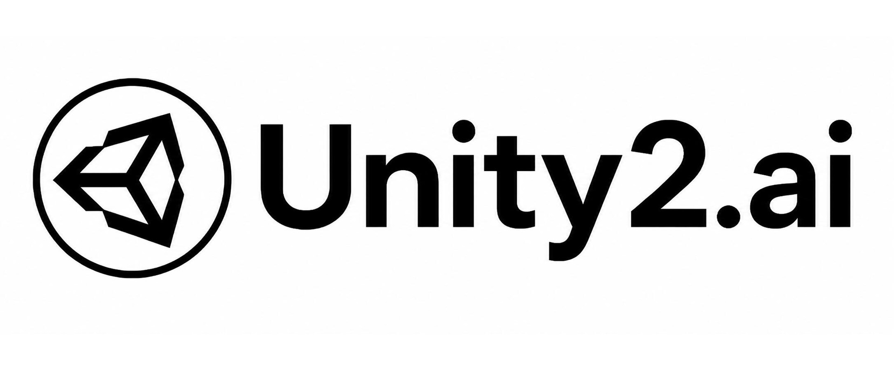

<div align="center">

# CCSwitchMulti

### 基于官方 CC Switch 的 Codex MultiRouter 分支

[](https://github.com/BigStrongSun/cc-switch/releases)
[](https://github.com/BigStrongSun/cc-switch/releases)
[](https://tauri.app/)
[](https://github.com/BigStrongSun/cc-switch/releases/latest)

<a href="https://trendshift.io/repositories/15372" target="_blank"></a>

### 🌐 The Only Official Website: **[ccswitch.io](https://ccswitch.io)**

English | [中文](README_ZH.md) | [日本語](README_JA.md) | [Deutsch](README_DE.md) | [Changelog](CHANGELOG.md)

</div>

<div align="center">


**求助和反馈**：可以提交 GitHub Issue，也可以扫码加入小红书讨论群一起讨论。（二维码有效期至 2026-07-20）

</div>

## CCSwitchMulti 分支说明

CCSwitchMulti 是基于官方 [CC Switch](https://github.com/farion1231/cc-switch) 继续维护的下游分支。它保留官方版本的桌面管理器、Provider 数据库、本地代理、MCP/Skills 同步、会话管理、云同步和 Tauri 跨平台结构，同时额外加入面向 Codex 的 MultiRouter 工作流，让多个模型来源可以合并到同一个 Codex Provider 后面使用。

后面的 README 仍然保留了上游 CC Switch 的原始说明。使用 `BigStrongSun/cc-switch` 发布版本时，请先阅读本节，因为这里记录的是 CCSwitchMulti 分支相对官方版本新增的能力、实现边界和使用注意事项。

### Codex 多路由配置说明书

如果你是第一次配置 Codex MultiRouter，请先看这份中文说明书：

**[CCSwitchMulti Codex 多路由使用说明](docs/guides/codex-multirouter-guide-zh.md)**

它按实际操作顺序覆盖 Codex Desktop 登录、CCSwitchMulti OAuth 授权、添加 DeepSeek / GLM / 本地模型源、开启 `需要本地路由映射`、获取模型列表、配置上下文窗口、创建多模型路由、设置子 Agent 前 5 个候选模型、启动 Codex 路由、Debug 检查、重启 Codex Desktop，以及历史记录修复。

### 适合谁使用

这个分支特别适合已经有 ChatGPT Pro、Plus 或 Team 订阅，并且希望把 GPT 系列最新、最强模型作为主 Agent 来做规划、决策和质量把关的用户。你可以让主 Agent 继续使用官方 GPT/Codex 能力，同时把大量可拆分的执行任务路由到自己的廉价 API、本地部署模型，或 DeepSeek V4、Qwen 等国产/开源模型上，从而降低 Codex 官方额度消耗。

典型用法是：主线程使用 GPT-5.5 / GPT-5.4 负责复杂判断、任务拆解和最终审查；子 Agent、批量执行、简单修复、日志分析、重复验证等工作交给 DeepSeek V4 Flash、Qwen、本地 vLLM 或其他 OpenAI-compatible API。按我们的实际测试，这种“强主 Agent + 低成本执行模型”的组合在不少 Codex 工作流里可以至少节约一半官方额度，具体节省比例取决于你的任务结构、路由规则和上游价格。

### 功能截图

#### Provider 列表中的 MultiRouter


`OpenAI Multi-Model Router` 会作为一个 Codex Provider 出现在列表中。它不是普通单一上游，而是一个本地路由入口：Codex 只连到 CCSwitchMulti，本地代理再按模型把请求分发到 OpenAI、Qwen、DeepSeek 或其他上游。

#### Codex 多模型路由工作台


多模型路由工作台会展示路由入口、本地监听、Codex 接管、启用规则和最近转发状态。这里用于判断 Codex 请求是否真的进入 MultiRouter，而不是只看模型菜单是否出现。


路由规则页可以把同一个 Codex 入口拆成多个上游规则：例如 `gpt-*` 走官方 OpenAI/Codex，`qwen3.6` 走本地或远端 vLLM，`deepseek-*` 走 DeepSeek API。规则启用后，Codex 侧只需要按模型名选择即可。

#### Codex Desktop 中的模型选择


接管成功后，Codex Desktop 的模型选择器可以同时看到 GPT-5.5、GPT-5.4、GPT-5.4 Mini、Codex Spark、Qwen3.6 Local、DeepSeek V4 Flash、DeepSeek V4 Pro 等候选模型。主 Agent 可以用官方 GPT，子任务可以切到更便宜的模型。

#### 使用统计与成本观测


统计页可以按模型查看请求数、token 和成本。截图中的工作流同时使用了 GPT-5.5、DeepSeek V4 Flash、Qwen3.6、GPT-5.4 Mini、GPT-5.4 和 Codex Spark，便于评估哪些任务适合迁移到低成本模型。

### 本分支额外提供的能力

- **Codex MultiRouter Provider**：提供一个通常名为 `OpenAI Multi-Model Router` 的 Codex Provider，可在同一个 Codex 模型选择器里展示并路由官方 OpenAI/Codex、Codex Spark、Qwen、DeepSeek 等模型来源。
- **模型目录投影**：在 CC Switch Provider 配置中维护路由模型目录，并写出 Codex 可读取的 `model_catalog_json`、`cc-switch-model-catalog.json` 和 CC Switch 接管的 `models_cache.json`，让 Codex 能发现合并后的候选模型。
- **按模型分流**：通过 `settings_config.codexRouting` 保存路由规则；Rust 本地代理会读取每次请求里的 `model`，选择匹配的上游，注入对应凭据，并在需要时把 OpenAI Responses 请求桥接到 Chat Completions 后端。
- **稳定的 Codex 运行桶**：MultiRouter 使用 `codex_model_router_v2` 作为运行时 provider bucket，而不是 Codex 内置 `openai` 或易漂移的通用 custom bucket，从而避免重新触发官方 OpenAI WebSocket 语义，并减少 Codex 历史记录分桶混乱。
- **Codex Desktop 模型菜单解锁**：包含运行时诊断和基于 CDP 的 renderer 注入，用于处理 Codex Desktop 里 Statsig 模型白名单导致本地/路由模型被隐藏的问题。
- **Codex 历史显示修复**：提供独立的历史修复工作区，可先 dry-run，再修复 provider bucket、session index、project hints、user-event 标记和当前 Desktop sqlite 位置等问题。
- **外部 OpenAI-compatible API sidecar**：提供单独的本地 OpenAI-compatible API 表面，给第三方客户端使用；它和 Codex takeover 端口不是同一路。

### 实现方式

Codex MultiRouter 不是简单地把 Codex 切到某一个第三方 Provider。CCSwitchMulti 会为 Codex 启用 app-level takeover，启动本地 Codex 代理端口，把 Codex live config 写成指向本地的 Responses-compatible Provider，并把真实上游、模型目录和路由计划保存在 CC Switch 数据库里。

关键实现点包括：

- Codex live config 中的 MultiRouter 运行桶是 `model_provider = "codex_model_router_v2"`。
- Codex config 顶层写入 `model_catalog_json = "cc-switch-model-catalog.json"`，同时在用户 Codex 配置目录下生成 catalog/cache 文件。
- `settings_config.modelCatalog` 是 CC Switch 侧维护可见模型的事实来源。
- `settings_config.codexRouting` 是 CC Switch 侧维护模型到上游路由规则的事实来源。
- 本地 router provider 写入 `supports_websockets = false`，让 Codex 走 HTTP Responses 路径，避免回到内置 OpenAI WebSocket 行为。
- Desktop 集成保留 `requires_openai_auth = true`，这样 ChatGPT OAuth 账号和额度状态仍可在 Codex Desktop 中显示，但实际请求仍由本地 MultiRouter 接管。

### 使用注意

- 需要 CCSwitchMulti 能力时，请使用 [BigStrongSun/cc-switch](https://github.com/BigStrongSun/cc-switch/releases) 的发布版本，不要下载上游官方 release。
- Codex 使用 `OpenAI Multi-Model Router` 时必须保持 CCSwitchMulti 运行，因为 Codex 请求会经过本地 takeover 代理。
- 修改 router 模型目录、路由规则或 takeover 状态后，需要完整退出并重新打开 Codex Desktop；已经运行的 Codex app-server 可能继续持有旧的模型管理器缓存。
- 如果诊断显示 catalog 已完整，但 Codex Desktop 模型菜单仍只显示官方模型，请通过 CCSwitchMulti 的模型菜单解锁流程启动 Codex，让 renderer 带 remote debugging 端口运行并接受运行时补丁。
- CCSwitchMulti 不会修改 Codex Desktop 磁盘上的 `app.asar`；模型菜单解锁是针对当前 Desktop 会话的运行时 renderer 注入。
- 不要把 router TOML、`model_catalog_json` 或 `127.0.0.1:<port>` 写进共享的 Codex common config。这些是 Provider takeover 私有字段，应由 CCSwitchMulti 写入。
- 不要让 MultiRouter 走 Codex 内置 `openai` Provider 或 `openai_base_url`。那条路径可能重新启用官方 OpenAI/WebSocket 语义，破坏路由和 fallback 边界。
- Qwen、DeepSeek 等非 OpenAI 路由仍依赖对应上游 endpoint、API key 和网络可用性。模型出现在菜单里只说明 catalog 可见，不代表请求一定成功。
- Codex takeover 端口和外部 OpenAI-compatible API sidecar 是两套不同入口；不要用 sidecar 的健康检查来判断 Codex MultiRouter 是否已经接管成功。

### 构建与发布说明

- 当前分支的包名/产品名是 `ccswitchmulti` / `CCSwitchMulti`。
- Windows 发布导出使用 `pnpm release:export`；本地打包在没有签名私钥时会显式关闭 updater artifact 签名。
- 免安装版仍使用系统默认用户数据和配置目录，因此除非明确要共享状态，否则不要同时运行上游官方 CC Switch 和 CCSwitchMulti。
- macOS 产物需要 macOS 构建、签名和 notarization 环境；Windows/WSL 构建不会产出已签名公证的 macOS 包。

## ❤️Sponsor

> [Want to appear here?](mailto:farion1231@gmail.com)

<details open>
<summary>Click to collapse</summary>

[](https://platform.minimax.io/subscribe/coding-plan?code=ClLhgxr2je&source=link)

Kimi K2.6 is an open-source, native multimodal agentic model from Moonshot AI, built for long-horizon coding, coding-driven design, and swarm-based task orchestration. It is designed to handle complex end-to-end engineering work across front-end, DevOps, performance optimization, and full-stack workflows, while coordinating large groups of specialized agents to plan, implement, test, and iterate on real coding tasks. **[Click here to start using Kimi](https://platform.moonshot.cn/console?aff=cc-switch)**

---

<table>
<tr>
<td width="180"><a href="https://www.packyapi.com/register?aff=cc-switch"></a></td>
<td>Thanks to PackyCode for sponsoring this project! PackyCode is a reliable and efficient API relay service provider, offering relay services for Claude Code, Codex, Gemini, and more. PackyCode provides special discounts for our software users: register using <a href="https://www.packyapi.com/register?aff=cc-switch">this link</a> and enter the "cc-switch" promo code during first recharge to get 10% off.</td>
</tr>

<tr>
<td width="180"><a href="https://aigocode.com/invite/CC-SWITCH"></a></td>
<td>Thanks to AIGoCode for sponsoring this project! AIGoCode is an all-in-one platform that integrates Claude Code, Codex, and the latest Gemini models, providing you with stable, efficient, and highly cost-effective AI coding services. The platform offers flexible subscription plans, zero risk of account suspension, direct access with no VPN required, and lightning-fast responses. AIGoCode has prepared a special benefit for CC Switch users: if you register via <a href="https://aigocode.com/invite/CC-SWITCH">this link</a>, you'll receive an extra 10% bonus credit on your first top-up!</td>
</tr>

<tr>
<td width="180"><a href="https://www.aicodemirror.com/register?invitecode=9915W3"></a></td>
<td>Thanks to AICodeMirror for sponsoring this project! AICodeMirror provides official high-stability relay services for Claude Code / Codex / Gemini CLI, with enterprise-grade concurrency, fast invoicing, and 24/7 dedicated technical support.
Claude Code / Codex / Gemini official channels at 38% / 2% / 9% of original price, with extra discounts on top-ups! AICodeMirror offers special benefits for CC Switch users: register via <a href="https://www.aicodemirror.com/register?invitecode=9915W3">this link</a> to enjoy 20% off your first top-up, and enterprise customers can get up to 25% off!</td>
</tr>

<tr>
<td width="180"><a href="https://www.shengsuanyun.com/?from=CH_4HHXMRYF"></a></td>
<td>Thanks to Shengsuanyun for sponsoring this project! Shengsuanyun is a super factory serving AI Native Teams — an industrial-grade AI task parallel execution platform. Its model marketplace aggregates Claude, ChatGPT, Gemini, and other domestic and international LLM and multimedia model capabilities with direct supply. Absolutely no reverse engineering or dilution — platform-wide model SLA availability reaches 99.7%, with <a href="https://watch.shengsuanyun.com/status/shengsuanyun">monitoring dashboards</a> showing green across the board. It also offers enterprise-grade custom gateways for fine-grained team cost and permission management, smart routing, security protection, and BYOK (Bring Your Own Key) hosting. The platform charges on a pay-per-use and tokens plan (coming soon) basis, with invoicing available. Register via <a href="https://www.shengsuanyun.com/?from=CH_4HHXMRYF">this link</a> as a new user to receive ¥10 in credits plus a 10% bonus on your first top-up.</td>
</tr>

<tr>
<td width="180"><a href="https://pateway.ai/?ch=etzpm8&aff=WB6M6F67#/"></a></td>
<td>Thanks to PatewayAI for sponsoring this project! PatewayAI is an API relay service provider built for heavy AI developers, focused on directly relaying official high-quality model APIs. It offers the full Claude lineup and the Codex series, 100% sourced from official channels — no dilution, no fakes, verification welcome. Billing is transparent and every token-level invoice can be audited line by line.
It also supports enterprise-grade concurrency and provides a dedicated management platform for enterprise customers — formal contracts and invoicing are available; visit the official website for contact details.
Register now via <a href="https://pateway.ai/?ch=etzpm8&aff=WB6M6F67#/">this link</a> to receive $3 in trial credit. Top-ups go as low as 60% of the original price, with a two-way referral bonus of up to $150!</td>
</tr>

<tr>
<td width="180"><a href="https://www.byteplus.com/en/product/modelark?utm_campaign=hw&utm_content=ccswitch&utm_medium=devrel_tool_web&utm_source=OWO&utm_term=ccswitch"></a></td>
<td>Thanks to Dola seed for sponsoring this project! Dola Seed 2.0 is a full‑modal general large model independently developed by ByteDance for the global market. Built on a unified multimodal architecture, it supports joint understanding and generation of text, images, audio, and video. It natively enables agent collaboration, with strong reasoning, long‑task execution, tool integration, and coding capabilities. It is widely applicable to smart cockpits, personal assistants, education, customer support, marketing, retail, and other scenarios. It excels in multimodal perception, end‑to‑end complex task delivery, stable interaction, and data security, and is readily accessible and deployable via the ModelArk platform.Register via <a href="https://www.byteplus.com/en/product/modelark?utm_campaign=hw&utm_content=ccswitch&utm_medium=devrel_tool_web&utm_source=OWO&utm_term=ccswitch">this link</a> to get 500,000 tokens of free inference quota per model.<a href="https://www.volcengine.com/activity/agentplan?utm_campaign=hw&utm_content=ccswitch&utm_medium=devrel_tool_web&utm_source=OWO&utm_term=ccswitch"> >>中国大陆地区的开发者请点击这里</a></td>
</tr>

<tr>
<td width="180"><a href="https://cloud.siliconflow.cn/i/drGuwc9k"></a></td>
<td>Thanks to SiliconFlow for sponsoring this project! SiliconFlow is a high-performance AI infrastructure and model API platform, providing fast and reliable access to language, speech, image, and video models in one place. With pay-as-you-go billing, broad multimodal model support, high-speed inference, and enterprise-grade stability, SiliconFlow helps developers and teams build and scale AI applications more efficiently. Register via <a href="https://cloud.siliconflow.cn/i/drGuwc9k">this link</a> and complete real-name verification to receive ¥16 in bonus credit, usable across models on the platform. SiliconFlow is also now compatible with OpenClaw, allowing users to connect a SiliconFlow API key and call major AI models for free.</td>
</tr>

<tr>
<td width="180"><a href="https://cubence.com/signup?code=CCSWITCH&source=ccs"></a></td>
<td>Thanks to Cubence for sponsoring this project! Cubence is a reliable and efficient API relay service provider, offering relay services for Claude Code, Codex, Gemini, and more with flexible billing options including pay-as-you-go and monthly plans. Cubence provides special discounts for CC Switch users: register using <a href="https://cubence.com/signup?code=CCSWITCH&source=ccs">this link</a> and enter the "CCSWITCH" promo code during recharge to get 10% off every top-up!</td>
</tr>

<tr>
<td width="180"><a href="https://www.dmxapi.cn/register?aff=bUHu"></a></td>
<td>Thanks to DMXAPI for sponsoring this project! DMXAPI provides global large model API services to 200+ enterprise users. One API key for all global models. Features include: instant invoicing, unlimited concurrency, starting from $0.15, 24/7 technical support. GPT/Claude/Gemini all at 32% off, domestic models 20-50% off, Claude Code exclusive models at 66% off! <a href="https://www.dmxapi.cn/register?aff=bUHu">Register here</a></td>
</tr>

<tr>
<td width="180"><a href="https://www.compshare.cn/coding-plan?ytag=GPU_YY_YX_git_cc-switch"></a></td>
<td>Thanks to Compshare for sponsoring this project! Compshare is UCloud's AI cloud platform, providing stable and comprehensive domestic and international model APIs with just one key. Featuring cost-effective monthly and per-use domestic-model Coding Plan packages, alongside stable officially-relayed overseas models. Supports Claude Code, Codex, and API access. Enterprise-grade high concurrency, 24/7 technical support, and self-service invoicing. Users who register via <a href="https://www.compshare.cn/coding-plan?ytag=GPU_YY_YX_git_cc-switch">this link</a> will receive a free 5 CNY platform trial credit!</td>
</tr>

<tr>
<td width="180"><a href="https://crazyrouter.com/register?aff=OZcm&ref=cc-switch"></a></td>
<td>Thanks to Crazyrouter for sponsoring this project! Crazyrouter is a high-performance AI API aggregation platform — one API key for 300+ models including Claude Code, Codex, Gemini CLI, and more. All models at 55% of official pricing with auto-failover, smart routing, and unlimited concurrency. Crazyrouter offers an exclusive deal for CC Switch users: register via <a href="https://crazyrouter.com/register?aff=OZcm&ref=cc-switch">this link</a> and contact customer support to claim <strong>$2 free credit</strong>, plus enter promo code `CCSWITCH` on your first top-up for an extra <strong>30% bonus credit</strong>! </td>
</tr>

<tr>
<td width="180"><a href="https://www.right.codes/register?aff=CCSWITCH"></a></td>
<td>Thank you to Right Code for sponsoring this project! Right Code reliably provides routing services for models such as Claude Code, Codex, and Gemini, with both pay-as-you-go and monthly subscription billing options available. Invoices are available upon top-up, and enterprise and team users can receive dedicated one-on-one support. Right Code also offers an exclusive discount for CC Switch users: register via <a href="https://www.right.codes/register?aff=CCSWITCH">this link</a>, and with every top-up you will receive pay-as-you-go credit equivalent to 5% of the amount paid.</td>
</tr>

<tr>
<td width="180"><a href="https://www.sssaicode.com/register?ref=DCP0SM"></a></td>
<td>Thanks to SSSAiCode for sponsoring this project! SSSAiCode is a stable and reliable API relay service, dedicated to providing stable, reliable, and affordable Claude and Codex model services, with same-day fast invoicing. SSSAiCode offers a special deal for CC Switch users: register via <a href="https://www.sssaicode.com/register?ref=DCP0SM">this link</a> to enjoy $10 extra credit on every top-up!</td>
</tr>

<tr>
<td width="180"><a href="https://www.micuapi.ai/register?aff=aOYQ"></a></td>
<td>Thanks to Micu API for sponsoring this project! Micu API is a global LLM relay service provider dedicated to delivering the best cost-performance ratio with high stability. Backed by a registered enterprise for core assurance, eliminating any risk of service discontinuation, with fast official invoicing support! We champion "zero cost to try": top up from as low as ¥1 with no minimum, and get fee-free refunds anytime! Micu API offers an exclusive deal for CC Switch users: register via <a href="https://www.micuapi.ai/register?aff=aOYQ">this link</a> and enter promo code "ccswitch" when topping up to enjoy a <strong>10% discount</strong>!</td>
</tr>

<tr>
<td width="180"><a href="https://lemondata.cc/r/FFX1ZDUP"></a></td>
<td>Thanks to LemonData for sponsoring this project! LemonData is a high-performance AI API aggregation platform — one API key for 300+ models including GPT, Claude, Gemini, DeepSeek, and more. All models priced 30–70% below official rates with auto-failover, smart routing, and unlimited concurrency. New users get $1 free credit instantly upon registration — sign up via <a href="https://lemondata.cc/r/FFX1ZDUP">this link</a>to claim your bonus and start building right away</strong>!</td>
</tr>

<tr>
<td width="180"><a href="https://etok.ai"></a></td>
<td>Thanks to ETok.ai for sponsoring this project! ETok.ai is dedicated to building a one-stop AI programming tool service platform. We offer professional Claude Code packages and technical community services, with support for Google Gemini and OpenAI Codex. Through carefully designed plans and a professional tech community, we provide developers with reliable service guarantees and continuous technical support, making AI-assisted programming a true productivity tool. Click <a href="https://etok.ai">here</a> to register!</td>
</tr>

<tr>
<td width="180"><a href="https://console.claudeapi.com/register?aff=pCLD"></a></td>
<td>This project is sponsored by <a href="https://console.claudeapi.com/register?aff=pCLD">Claude API</a>. Direct Claude API access — connect Claude Code and Agent apps in 3 minutes. New users can claim a free trial credit.Powered by official Anthropic API keys + AWS Bedrock official channels. No reverse engineering, no model degradation. Full support for Opus / Sonnet / Haiku model lineup, with official capabilities preserved including Tool Use, 1M context window, and more. Built for Claude Code power users, Agent engineers, and enterprise engineering teams. Invoicing and dedicated team support available. Click <a href="https://console.claudeapi.com/register?aff=pCLD">here</a> to register!</td>
</tr>

<tr>
<td width="180"><a href="https://claudecn.top"></a></td>
<td>Thanks to ClaudeCN for sponsoring this project! ClaudeCN is an enterprise-grade AI gateway platform operated by a registered company. It delivers high-availability commercial API access to popular models including Claude, GPT, and DeepSeek, and is built around formal enterprise procurement workflows — corporate bank transfers, signed contracts, and full compliance. Register via <a href="https://claudecn.top">this link</a>!</td>
</tr>

<tr>
<td width="180"><a href="https://runapi.co"></a></td>
<td>Thanks to RunAPI for sponsoring this project! RunAPI is a high-performance and reliable AI model API gateway — one API key gives you access to 150+ mainstream models including OpenAI, Claude, Gemini, DeepSeek, and Grok, with prices as low as 10% of the official rate and excellent stability. It works seamlessly with Claude Code, OpenClaw, and other tools. Exclusive benefit for CC Switch users: register and contact customer support to claim a free ¥14 credit. Register via <a href="https://runapi.co">this link</a>!</td>
</tr>

<tr>
<td width="180"><a href="https://apikey.fun/register?aff=CCSwitch"></a></td>
<td>Thanks to APIKEY.FUN for sponsoring this project! APIKEY.FUN is a professional enterprise-grade AI relay platform dedicated to providing stable, efficient, and low-cost AI model API access for enterprises and individual developers. The platform supports popular mainstream models such as Claude, OpenAI, and Gemini, with prices as low as 7% of official rates. Register through this project's <a href="https://apikey.fun/register?aff=CCSwitch">exclusive link</a> to enjoy an exclusive offer of up to <strong>permanent 5% off top-ups</strong>.</td>
</tr>

<tr>
<td width="180"><a href="https://apinebula.com/02rw5X"></a></td>
<td>Thanks to APINEBULA for sponsoring this project! APINEBULA, an enterprise-grade AI aggregation platform under Galaxy Video Bureau, leverages extensive platform resources to provide developers, teams, and enterprises with stable, cost-effective access to large language model APIs. The platform integrates leading, full-powered models like Claude, GPT, and Gemini, allowing you to connect to the world's top AI models through a single API, with prices starting as low as 10% of the original cost. Designed for AI programming, Agent development, and business system integration, APINEBULA supports enterprise-grade high concurrency, formal contracts, corporate bank transfers, and invoicing services. APINEBULA provides special discounts for our software users: register using <a href="https://apinebula.com/02rw5X">this link</a> and enter the <strong>"ccswitch"</strong> promo code during your first recharge to get <strong>10% off</strong>.</td>
</tr>

<tr>
<td width="180"><a href="https://www.atlascloud.ai/coding-plan?utm_source=github&utm_campaign=cc-switch"></a></td>
<td>Atlas Cloud is a full-modal AI inference platform that gives developers a single AI API to access video generation, image generation, and LLM APIs. Instead of managing multiple vendor integrations, you connect once and get unified access to 300+ curated models across all modalities. Check out Atlas Cloud's new <a href="https://www.atlascloud.ai/coding-plan?utm_source=github&utm_campaign=cc-switch">coding plan</a> promotion for more budget-friendly API access!</td>
</tr>

<tr>
<td width="180"><a href="https://www.ccsub.net/register?ref=Y6Z8DXEA"></a></td>
<td>Thanks to CCSub for sponsoring this project! CCSub is a stable, affordable AI API relay platform — your drop-in replacement for a Claude.ai subscription. One API key gives you access to Claude Opus 4.8, Sonnet, Haiku, GPT-5, Gemini, and DeepSeek at roughly 30% of direct API cost, with no VPN required from anywhere in the world. Compatible with Claude Code, Codex, Cursor, Cline, Continue, Windsurf, and all major AI coding tools. Register via <a href="https://www.ccsub.net/register?ref=Y6Z8DXEA">this link</a> and get $5 free credit on sign-up.</td>
</tr>

<tr>
<td width="180"><a href="https://unity2.ai/register?source=ccs"></a></td>
<td>Thanks to Unity2.ai for sponsoring this project! Unity2.ai is a high-performance AI model API relay platform for individual developers, teams, and enterprises. Long trusted by leading companies in China, it serves over 30 billion tokens per day and supports high concurrency at the 5,000 RPM level. It offers balance-based billing, first top-up bonuses, bundle subscriptions, corporate invoicing, and dedicated support. Register via <a href="https://unity2.ai/register?source=ccs">this link</a> to get $2 in credits, plus another $10 for joining the official group — up to $12 in free credits!</td>
</tr>

</table>

</details>

## Why CC Switch?

Modern AI-powered coding relies on tools like Claude Code, Claude Desktop, Codex, Gemini CLI, OpenCode, OpenClaw, and Hermes — but each has its own configuration format. Switching API providers means manually editing JSON, TOML, or `.env` files, and there is no unified way to manage MCP and Skills across multiple tools.

**CC Switch** gives you a single desktop app to manage all supported AI tools. Instead of editing config files by hand, you get a visual interface to import providers with one click, switch between them instantly, with 50+ built-in provider presets, unified MCP and Skills management, and system tray quick switching — all backed by a reliable SQLite database with atomic writes that protect your configs from corruption.

- **One App, Seven Tools** — Manage Claude Code, Claude Desktop, Codex, Gemini CLI, OpenCode, OpenClaw, and Hermes from a single interface
- **No More Manual Editing** — 50+ provider presets including AWS Bedrock, NVIDIA NIM, and community relays; just pick and switch
- **Unified MCP & Skills Management** — One panel to manage MCP servers and Skills across Claude, Codex, Gemini, OpenCode, and Hermes with bidirectional sync
- **System Tray Quick Switch** — Switch providers instantly from the tray menu, no need to open the full app
- **Cloud Sync** — Sync provider data across devices via Dropbox, OneDrive, iCloud, or WebDAV servers
- **Cross-Platform** — Native desktop app for Windows, macOS, and Linux, built with Tauri 2
- **Built-in Utilities** — Includes various utilities for first-launch login confirmation, signature bypass, plugin extension sync, and more

## Screenshots

|                  Main Interface                   |                  Add Provider                  |
| :-----------------------------------------------: | :--------------------------------------------: |
|  |  |

## Features

[Full Changelog](CHANGELOG.md) | [Release Notes](docs/release-notes/v3.16.1-en.md)

### Provider Management

- **7 supported tools, 50+ presets** — Claude Code, Claude Desktop, Codex, Gemini CLI, OpenCode, OpenClaw, Hermes; copy your key and import with one click
- **Universal providers** — One config syncs to Claude Code, Codex, and Gemini CLI
- One-click switching, system tray quick access, drag-and-drop sorting, import/export

### Proxy & Failover

- **Local proxy with hot-switching** — Format conversion, auto-failover, circuit breaker, provider health monitoring, and request rectifier
- **App-level takeover** — Independently proxy Claude, Codex, or Gemini, down to individual providers

### MCP, Prompts & Skills

- **Unified MCP panel** — Manage MCP servers across Claude, Codex, Gemini, OpenCode, and Hermes with bidirectional sync and Deep Link import
- **Prompts** — Markdown editor with cross-app sync (CLAUDE.md / AGENTS.md / GEMINI.md) and backfill protection
- **Skills** — One-click install from GitHub repos or ZIP files, custom repository management, with symlink and file copy support

### Usage & Cost Tracking

- **Usage dashboard** — Track spending, requests, and tokens with trend charts, detailed request logs, and custom per-model pricing

### Session Manager & Workspace

- Browse, search, and restore conversation history across supported session sources
- **Workspace editor** (OpenClaw) — Edit agent files (AGENTS.md, SOUL.md, etc.) with Markdown preview

### System & Platform

- **Cloud sync** — Custom config directory (Dropbox, OneDrive, iCloud, NAS) and WebDAV server sync
- **Deep Link** (`ccswitch://`) — Import providers, MCP servers, prompts, and skills via URL
- Dark / Light / System theme, auto-launch, auto-updater, atomic writes, auto-backups, i18n (zh/zh-TW/en/ja)

## FAQ

<details>
<summary><strong>Which AI tools does CC Switch support?</strong></summary>

CC Switch supports seven tools: **Claude Code**, **Claude Desktop**, **Codex**, **Gemini CLI**, **OpenCode**, **OpenClaw**, and **Hermes**. Each tool has dedicated provider presets and configuration management.

</details>

<details>
<summary><strong>Do I need to restart the terminal after switching providers?</strong></summary>

For most tools, yes — restart your terminal or the CLI tool for changes to take effect. The exception is **Claude Code**, which currently supports hot-switching of provider data without a restart.

</details>

<details>
<summary><strong>My plugin configuration disappeared after switching providers — what happened?</strong></summary>

CC Switch provides a "Shared Config Snippet" feature to pass common data (beyond API keys and endpoints) between providers. Go to "Edit Provider" → "Shared Config Panel" → click "Extract from Current Provider" to save all common data. When creating a new provider, check "Write Shared Config" (enabled by default) to include plugin data in the new provider. All your configuration items are preserved in the default provider imported when you first launched the app.

</details>

<details>
<summary><strong>macOS installation</strong></summary>

CC Switch for macOS is code-signed and notarized by Apple. You can download and install it directly — no extra steps needed. We recommend using the `.dmg` installer.

</details>

<details>
<summary><strong>Why can't I delete the currently active provider?</strong></summary>

CC Switch follows a "minimal intrusion" design principle — even if you uninstall the app, your CLI tools will continue to work normally. The system always keeps one active configuration, because deleting all configurations would make the corresponding CLI tool unusable. If you rarely use a specific CLI tool, you can hide it in Settings. To switch back to official login, see the next question.

</details>

<details>
<summary><strong>How do I switch back to official login?</strong></summary>

Add an official provider from the preset list. After switching to it, run the Log out / Log in flow, and then you can freely switch between the official provider and third-party providers. Codex supports switching between different official providers, making it easy to switch between multiple Plus or Team accounts.

</details>

<details>
<summary><strong>Where is my data stored?</strong></summary>

- **Database**: `~/.cc-switch/cc-switch.db` (SQLite — providers, MCP, prompts, skills)
- **Local settings**: `~/.cc-switch/settings.json` (device-level UI preferences)
- **Backups**: `~/.cc-switch/backups/` (auto-rotated, keeps 10 most recent)
- **Skills**: `~/.cc-switch/skills/` (symlinked to corresponding apps by default)
- **Skill Backups**: `~/.cc-switch/skill-backups/` (created automatically before uninstall, keeps 20 most recent)

</details>

## Documentation

For detailed guides on every feature, check out the **[User Manual](docs/user-manual/en/README.md)** — covering provider management, MCP/Prompts/Skills, proxy & failover, and more.

## Quick Start

### Basic Usage

1. **Add Provider**: Click "Add Provider" → Choose a preset or create custom configuration
2. **Switch Provider**:
   - Main UI: Select provider → Click "Enable"
   - System Tray: Click provider name directly (instant effect)
3. **Takes Effect**: Restart your terminal or the corresponding CLI tool to apply changes (Claude Code does not require a restart)
4. **Back to Official**: Add an "Official Login" preset, restart the CLI tool, then follow its login/OAuth flow

### MCP, Prompts, Skills & Sessions

- **MCP**: Click the "MCP" button → Add servers via templates or custom config → Toggle per-app sync
- **Prompts**: Click "Prompts" → Create presets with Markdown editor → Activate to sync to live files
- **Skills**: Click "Skills" → Browse GitHub repos → One-click install to supported apps
- **Sessions**: Click "Sessions" → Browse, search, and restore conversation history across supported session sources

> **Note**: On first launch, you can manually import existing CLI tool configs as the default provider.

## Download & Installation

### System Requirements

- **Windows**: Windows 10 and above
- **macOS**: macOS 12 (Monterey) and above
- **Linux**: Ubuntu 22.04+ / Debian 11+ / Fedora 34+ and other mainstream distributions

### Windows Users

Download the latest `CCSwitchMulti-v{version}-Windows.msi` installer or `CCSwitchMulti-v{version}-Windows-Portable.zip` portable version from the [Releases](../../releases) page.

### macOS Users

**Method 1: Install via Homebrew (Recommended)**

```bash
brew install --cask cc-switch
```

Update:

```bash
brew upgrade --cask cc-switch
```

**Method 2: Manual Download**

Download `CCSwitchMulti-v{version}-macOS.dmg` (recommended) or `.zip` from the [Releases](../../releases) page.

> **Note**: CC Switch for macOS is code-signed and notarized by Apple. You can install and open it directly.

### Arch Linux Users

**Install via paru (Recommended)**

```bash
paru -S cc-switch-bin
```

### Linux Users

Download the latest Linux build from the [Releases](../../releases) page:

- `CCSwitchMulti-v{version}-Linux.deb` (Debian/Ubuntu)
- `CCSwitchMulti-v{version}-Linux.rpm` (Fedora/RHEL/openSUSE)
- `CCSwitchMulti-v{version}-Linux.AppImage` (Universal)

> **Flatpak**: Not included in official releases. You can build it yourself from the `.deb` — see [`flatpak/README.md`](flatpak/README.md) for instructions.

<details>
<summary><strong>Architecture Overview</strong></summary>

### Design Principles

```
┌─────────────────────────────────────────────────────────────┐
│                    Frontend (React + TS)                    │
│  ┌─────────────┐  ┌──────────────┐  ┌──────────────────┐    │
│  │ Components  │  │    Hooks     │  │  TanStack Query  │    │
│  │   (UI)      │──│ (Bus. Logic) │──│   (Cache/Sync)   │    │
│  └─────────────┘  └──────────────┘  └──────────────────┘    │
└────────────────────────┬────────────────────────────────────┘
                         │ Tauri IPC
┌────────────────────────▼────────────────────────────────────┐
│                  Backend (Tauri + Rust)                     │
│  ┌─────────────┐  ┌──────────────┐  ┌──────────────────┐    │
│  │  Commands   │  │   Services   │  │  Models/Config   │    │
│  │ (API Layer) │──│ (Bus. Layer) │──│     (Data)       │    │
│  └─────────────┘  └──────────────┘  └──────────────────┘    │
└─────────────────────────────────────────────────────────────┘
```

**Core Design Patterns**

- **SSOT** (Single Source of Truth): All data stored in `~/.cc-switch/cc-switch.db` (SQLite)
- **Dual-layer Storage**: SQLite for syncable data, JSON for device-level settings
- **Dual-way Sync**: Write to live files on switch, backfill from live when editing active provider
- **Atomic Writes**: Temp file + rename pattern prevents config corruption
- **Concurrency Safe**: Mutex-protected database connection avoids race conditions
- **Layered Architecture**: Clear separation (Commands → Services → DAO → Database)

**Key Components**

- **ProviderService**: Provider CRUD, switching, backfill, sorting
- **McpService**: MCP server management, import/export, live file sync
- **ProxyService**: Local proxy mode with hot-switching and format conversion
- **SessionManager**: Conversation history browsing across supported session sources
- **ConfigService**: Config import/export, backup rotation
- **SpeedtestService**: API endpoint latency measurement

</details>

<details>
<summary><strong>Development Guide</strong></summary>

### Environment Requirements

- Node.js 18+
- pnpm 8+
- Rust 1.85+
- Tauri CLI 2.8+

### Development Commands

```bash
# Install dependencies
pnpm install

# Dev mode (hot reload)
pnpm dev

# Type check
pnpm typecheck

# Format code
pnpm format

# Check code format
pnpm format:check

# Run frontend unit tests
pnpm test:unit

# Run tests in watch mode (recommended for development)
pnpm test:unit:watch

# Build application
pnpm build

# Build debug version
pnpm tauri build --debug
```

### Rust Backend Development

```bash
cd src-tauri

# Format Rust code
cargo fmt

# Run clippy checks
cargo clippy

# Run backend tests
cargo test

# Run specific tests
cargo test test_name

# Run tests with test-hooks feature
cargo test --features test-hooks
```

### Testing Guide

**Frontend Testing**:

- Uses **vitest** as test framework
- Uses **MSW (Mock Service Worker)** to mock Tauri API calls
- Uses **@testing-library/react** for component testing

**Running Tests**:

```bash
# Run all tests
pnpm test:unit

# Watch mode (auto re-run)
pnpm test:unit:watch

# With coverage report
pnpm test:unit --coverage
```

### Tech Stack

**Frontend**: React 18 · TypeScript · Vite · TailwindCSS 3.4 · TanStack Query v5 · react-i18next · react-hook-form · zod · shadcn/ui · @dnd-kit

**Backend**: Tauri 2.8 · Rust · serde · tokio · thiserror · tauri-plugin-updater/process/dialog/store/log

**Testing**: vitest · MSW · @testing-library/react

</details>

<details>
<summary><strong>Project Structure</strong></summary>

```
├── src/                        # Frontend (React + TypeScript)
│   ├── components/
│   │   ├── providers/          # Provider management
│   │   ├── mcp/                # MCP panel
│   │   ├── prompts/            # Prompts management
│   │   ├── skills/             # Skills management
│   │   ├── sessions/           # Session Manager
│   │   ├── proxy/              # Proxy mode panel
│   │   ├── openclaw/           # OpenClaw config panels
│   │   ├── settings/           # Settings (Terminal/Backup/About)
│   │   ├── deeplink/           # Deep Link import
│   │   ├── env/                # Environment variable management
│   │   ├── universal/          # Cross-app configuration
│   │   ├── usage/              # Usage statistics
│   │   └── ui/                 # shadcn/ui component library
│   ├── hooks/                  # Custom hooks (business logic)
│   ├── lib/
│   │   ├── api/                # Tauri API wrapper (type-safe)
│   │   └── query/              # TanStack Query config
│   ├── locales/                # Translations (zh/zh-TW/en/ja)
│   ├── config/                 # Presets (providers/mcp)
│   └── types/                  # TypeScript definitions
├── src-tauri/                  # Backend (Rust)
│   └── src/
│       ├── commands/           # Tauri command layer (by domain)
│       ├── services/           # Business logic layer
│       ├── database/           # SQLite DAO layer
│       ├── proxy/              # Proxy module
│       ├── session_manager/    # Session management
│       ├── deeplink/           # Deep Link handling
│       └── mcp/                # MCP sync module
├── tests/                      # Frontend tests
└── assets/                     # Screenshots & partner resources
```

</details>

## Contributing

Issues and suggestions are welcome!

Before submitting PRs, please ensure:

- Pass type check: `pnpm typecheck`
- Pass format check: `pnpm format:check`
- Pass unit tests: `pnpm test:unit`

For new features, please open an issue for discussion before submitting a PR. PRs for features that are not a good fit for the project may be closed.

## Star History

[](https://www.star-history.com/#farion1231/cc-switch&Date)

## License

MIT © Jason Young
